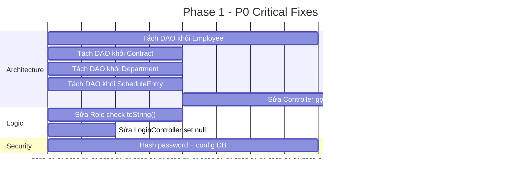
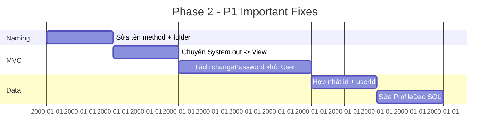
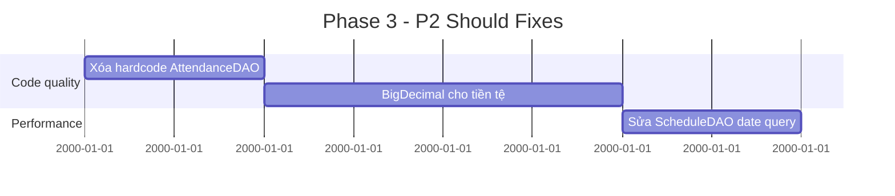

# KẾ HOẠCH SỬA CHỮA CHI TIẾT
## Quản Lý Nhân Sự Console — Fix Plan

**Ngày tạo:** 25/06/2026
**Mục tiêu:** Khắc phục tất cả lỗi đã phát hiện, đạt chuẩn BCE, hoàn thiện đồ án

---

## MỤC LỤC
1. [Phân loại ưu tiên](#1-phân-loại-ưu-tiên)
2. [P0 — Sửa gấp (Critical)](#2-p0--sửa-gấp-critical)
3. [P1 — Quan trọng (Important)](#3-p1--quan-trọng-important)
4. [P2 — Nên sửa (Should)](#4-p2--nên-sửa-should)
5. [P3 — Có thể sửa (Nice to have)](#5-p3--có-thể-sửa-nice-to-have)
6. [Bảng tổng hợp tất cả lỗi](#6-bảng-tổng-hợp-tất-cả-lỗi)
7. [Tiến độ thực hiện](#7-tiến-độ-thực-hiện)

---

## 1. PHÂN LOẠI ƯU TIÊN

| Mức | Mô tả | Số lượng lỗi |
|---|---|---|
| 🔴 **P0** | Sửa gấp — lỗi nghiêm trọng, ảnh hưởng kiến trúc, bảo mật | 8 |
| 🟠 **P1** | Quan trọng — lỗi logic, naming, chuẩn hóa | 12 |
| 🟡 **P2** | Nên sửa — clean code, tối ưu | 10 |
| ⚪ **P3** | Có thể sửa — nâng cao chất lượng | 7 |

---

## 2. P0 — SỬA GẤP (CRITICAL)

### P0-1: Tách static DAO khỏi Model (5 files)

**Vấn đề:** Model chứa `private static XXXDao dao = new XXXDao()` — Entity không còn thuần túy, vi phạm MVC và chuẩn BCE.

**Các file cần sửa:**

| File | Dòng cần xóa | Dòng cần sửa |
|---|---|---|
| `src/model/hr/Employee.java` | `private static EmployeeDAO employeeDAO = new EmployeeDAO();` | Xóa các method static `save()`, `update()`, `delete()`, `findById()`, `findByUserId()`, `findAll()`, `findByDepartment()`, `search()` |
| `src/model/Contract.java` | `private static ContractDAO contractDAO = new ContractDAO();` | Xóa các method static `save()`, `update()`, `delete()`, `findById()`, `findAll()`, `findByEmployee()`, `search()` |
| `src/model/Department.java` | `private static DepartmentDAO dao = new DepartmentDAO();` | Xóa các method static `save()`, `update()`, `delete()`, `findById()`, `findAll()`, `getEmployees()` |
| `src/model/ScheduleEntry.java` | `private static ScheduleDAO dao = new ScheduleDAO();` | Xóa các method static `save()`, `update()`, `delete()`, `findById()`, `findAll()`, `findByEmployeeAndMonth()` |
| `src/model/User.java` | `public static List<User> getAllEmployee()` | Xóa method static này (dùng `EmployeeDAO.findAll()` thay thế) |

**Các Controller bị ảnh hưởng (cần sửa để gọi DAO thay vì Model):**

| Controller | Dòng lỗi | Sửa thành |
|---|---|---|
| `AttendanceController.java` | `Department.findAll()` | `new DepartmentDAO().findAll()` |
| `AttendanceController.java` | `Department.findById(id)` | `new DepartmentDAO().findById(id)` |
| `EmployeeListController.java` | `Department.findAll()` | `new DepartmentDAO().findAll()` |
| `EmployeeListController.java` | `Department.findById(id)` | `new DepartmentDAO().findById(id)` |
| `EmployeeListController.java` | `Employee.search(kw, status, deptId)` | `new EmployeeDAO().search(kw, status, deptId)` |
| `ContractManagementController.java` | ✅ Dùng role check → cần sửa |
| `CreateContractController.java` | `contract.save()` | `new ContractDAO().save(contract)` |
| `CreateContractController.java` | `isContractCodeExists()` | `new ContractDAO().findByContractCode(code)` |
| `ViewContractController.java` | `Contract.findAll()` | `new ContractDAO().findAll()` |
| `ViewContractController.java` | `Contract.search(kw, status, type)` | `new ContractDAO().search(kw, status, type)` |
| `ViewContractController.java` | `Contract.findById(id)` | `new ContractDAO().findById(id)` |
| `ViewContractController.java` | `Contract.findByEmployee(empId)` | `new ContractDAO().findByEmployee(empId)` |
| `ViewContractController.java` | `Contract.findById(id)` + `c.delete()` | `new ContractDAO().delete(id)` |
| `MyProfileController.java` | `Employee.findByUserId(userId)` | `new EmployeeDAO().findByUserId(userId)` |
| `ScheduleController.java` | `ScheduleEntry.findByEmployeeAndMonth(...)` | `new ScheduleDAO().findByEmployeeAndMonth(...)` |
| `ScheduleController.java` | `Department.findById(deptId)` | `new DepartmentDAO().findById(deptId)` |
| `ProfileController.java` | ✅ Không dùng |
| `ViewEmployeeProfileController.java` | `User.getAllEmployee()` | `new EmployeeDAO().findAll()` |
| `CalcSalaryController.java` | ✅ Đã dùng DAO trực tiếp |
| `SubmitCVView.java` | ✅ Gọi qua Controller |
| `ReviewApplicationsView.java` | ✅ Gọi qua Controller |

**Tổng số file cần sửa: ~18 files**
**Độ khó: 🔴 Cao**

---

### P0-2: Sửa lỗi so sánh Role sai (5 files)

**Vấn đề:** Một số Controller so sánh role với `.toString()` thay vì so sánh Enum trực tiếp, dẫn đến logic luôn sai.

**Các file cần sửa:**

| File | Dòng lỗi | Sửa thành |
|---|---|---|
| `RecruitmentManagementController.java` | `!MainController.currentUser.getRole().equals(RoleEnum.EMPLOYER.toString())` | `MainController.currentUser.getRole() != RoleEnum.EMPLOYER` |
| `CreatePostRecruimentController.java` | `!MainController.currentUser.getRole().equals(RoleEnum.EMPLOYER.toString())` | `MainController.currentUser.getRole() != RoleEnum.EMPLOYER` |
| `ReviewApplicationsController.java` | `!MainController.currentUser.getRole().equals(RoleEnum.EMPLOYER.toString())` | `MainController.currentUser.getRole() != RoleEnum.EMPLOYER` |
| `ScheduleInterviewController.java` | `!MainController.currentUser.getRole().equals(RoleEnum.EMPLOYER.toString())` | `MainController.currentUser.getRole() != RoleEnum.EMPLOYER` |
| `SubmitCVController.java` | `!MainController.currentUser.getRole().equals(RoleEnum.CANDIDATE.toString())` | `MainController.currentUser.getRole() != RoleEnum.CANDIDATE` |

**Tổng số file cần sửa: 5 files**
**Độ khó: 🟢 Dễ**

---

### P0-3: Sửa `LoginController.goToHome()` — set null sai

**Vấn đề:** `finally { MainController.currentUser = null; }` set null sau khi đã vào Home — mất user.

**File:** `src/controller/LoginController.java`

**Cách sửa:**
```java
public void goToHome() throws Exception {
    HomeController hc = new HomeController();
    hc.show();
    // Xóa finally block — không set null currentUser
}
```

**Tổng số file cần sửa: 1 file**
**Độ khó: 🟢 Dễ**

---

### P0-4: Hardcode DB connection + Password plaintext

**Vấn đề:** DB password trống, hardcode URL/credentials trong code. Password lưu plaintext.

**File:** `src/dao/DatabaseConnection.java`

**Hướng sửa (tùy chọn):**
1. Thêm file `config.properties` bên ngoài source code
2. Hoặc dùng biến môi trường
3. Hoặc giữ nguyên nhưng thêm comment TODO (vì đồ án, có thể chấp nhận)

**File:** `src/dao/UserDAO.java` (lưu plaintext) + `LoginController.java` (so sánh plaintext)

**Hướng sửa:** Hash password với SHA-256/Bcrypt khi lưu và khi kiểm tra

**Độ khó: 🟠 Trung bình** (nếu implement hash)

---

## 3. P1 — QUAN TRỌNG (IMPORTANT)

### P1-1: Chuẩn hóa naming convention

| File | Lỗi | Sửa thành |
|---|---|---|
| `controller/HomeController.java` | `excuteComent()` | `executeCommand()` |
| `controller/recruimentManagement/` (folder) | `recruiment` | `recruitment` |
| `controller/RecruitmentManagementController.java` | `excuteCommand()` | `executeCommand()` |
| `model/calcSalary/TaxBraket.java` | `Braket` | `Bracket` (đã giữ nguyên theo kế hoạch cũ) |
| `view/RecruitmentManagement/CreatePostRecruimentView.java` | `Recruiment` | `Recruitment` |

**Độ khó: 🟢 Dễ**
**Lưu ý:** Đổi tên folder `recruimentManagement` → `recruitmentManagement` sẽ ảnh hưởng đến tất cả import. Cần sửa đồng bộ.

---

### P1-2: Controller gọi UI trực tiếp (System.out.println)

**Vấn đề:** Một số Controller dùng `System.out.println` để hiển thị thông báo thay vì gọi View.

| File | Dòng lỗi | Sửa thành |
|---|---|---|
| `CreateNewProfileController.java` | `System.out.println("Tạo hồ sơ thành công")` | `cpv.showMessage("Tạo hồ sơ thành công")` |
| `CreateNewProfileController.java` | `System.out.println("Lỗi: " + e.getMessage())` | `cpv.showError("Lỗi: " + e.getMessage())` |
| `CreateNewProfileController.java` | `System.out.println("Tạo hồ sơ thành công")` | Thêm method `showMessage()` vào `CreateProfileView` |

**Độ khó: 🟢 Dễ**

---

### P1-3: Thêm method showMessage/showError cho View thiếu

**Vấn đề:** Một số View không có method `showMessage()` / `showError()`.

| View | Cần thêm |
|---|---|
| `CreateProfileView.java` | Thêm `showMessage(String)` và `showError(String)` |
| `ProfileManagementView.java` | Kế thừa `View.showError()` — đã có sẵn |
| `CreatePostRecruimentView.java` | ✅ Đã có `showMessage()` |

**Độ khó: 🟢 Dễ**

---

### P1-4: `User.java` — hai trường ID (id + userId)

**Vấn đề:** `User` có cả `id` (long) và `userId` (int) cho cùng một khái niệm.

**File:** `src/model/User.java`

**Cách sửa:**
- Giữ `userId` (int) làm ID chính
- Xóa `id` (long) và các getter/setter tương ứng
- Sửa các chỗ dùng `user.getId()` → `user.getUserId()`

**Các file bị ảnh hưởng:**
- `ProfileView.java` — `u.getId()` → `u.getUserId()`
- `ProfileDao.java` — dùng `id` trong SQL → dùng `user_id`
- `CreateProfileView.java` — `user.setId(...)` → `user.setUserId(...)`

**Độ khó: 🟠 Trung bình**

---

### P1-5: `User.java` — changePassword() gọi DAO

**Vấn đề:** `User.changePassword()` gọi `UserDAO.update(this)` — Model gọi DAO.

**File:** `src/model/User.java`

**Cách sửa:**
- Chuyển logic `changePassword()` lên `ChangePasswordController`
- Model `User` chỉ giữ getter/setter + validation thuần túy
- Controller gọi `UserDAO.update()` sau khi validate

**Độ khó: 🟠 Trung bình**

---

### P1-6: `User.java` — getAllEmployee() static

**Vấn đề:** `User.getAllEmployee()` là static method gọi `ProfileDao`.

**File:** `src/model/User.java`
**Sửa ở:** `ViewEmployeeProfileController.java` — dùng `new EmployeeDAO().findAll()` thay thế

**Độ khó: 🟢 Dễ**

---

## 4. P2 — NÊN SỬA (SHOULD)

### P2-1: AttendanceDAO — xóa createDefaultPeriod() hardcode

**Vấn đề:** `AttendanceDAO.createDefaultPeriod()` hardcode dữ liệu fake cho department 1, 2, 3.

**File:** `src/dao/AttendanceDAO.java`

**Cách sửa:** Xóa hoặc comment method, thay bằng logic query DB thật.

**Độ khó: 🟢 Dễ**

---

### P2-2: `Parameter` dùng `double` cho tiền tệ

**Vấn đề:** Tất cả field tiền tệ dùng `double` — có thể gây lỗi rounding.

**File:** `src/model/calcSalary/Parameter.java`, `Payroll.java`, `PayrollDetail.java`, `AttendanceDetail.java`

**Cách sửa:** Thay `double` → `BigDecimal` (theo kế hoạch cũ, đã giữ nguyên)

**Độ khó: 🟠 Trung bình** (ảnh hưởng nhiều file tính lương)

---

### P2-3: `UserDAO` — dùng PreparedStatement pattern lặp lại

**Vấn đề:** `UserDAO` có 3 method gần giống nhau `findByUsername`, `findByEmail`, `findById` — code bị duplicate.

**File:** `src/dao/UserDAO.java`

**Cách sửa:** Tạo method `mapUser(ResultSet)` dùng chung (đã có thể dùng nhưng code lặp).

**Độ khó: 🟢 Dễ**

---

### P2-4: `ScheduleDAO` — dùng STR_TO_DATE cho date string

**Vấn đề:** `ScheduleDAO.findByEmployeeAndMonth()` dùng `STR_TO_DATE(date, '%d/%m/%Y')` — kém hiệu quả.

**File:** `src/dao/ScheduleDAO.java`

**Cách sửa:** Đổi kiểu cột `date` trong DB thành `DATE` thay vì string.

**Độ khó: 🟠 Trung bình** (cần sửa DB)

---

### P2-5: `ProfileDao` — SQL dùng sai tên cột

**Vấn đề:** `ProfileDao.getAllUsers()` dùng SQL: `SELECT id, fullName, dateOfBirth, ... FROM users` nhưng bảng `users` trong DB có cột `user_id`, `full_name`, `date_of_birth` (snake_case).

**File:** `src/dao/ProfileDao/ProfileDao.java`

**Cách sửa:** Đồng bộ tên cột SQL với tên cột thực tế trong DB.

**Độ khó: 🟢 Dễ**

---

## 5. P3 — CÓ THỂ SỬA (NICE TO HAVE)

### P3-1: Thêm Service Layer

**Vấn đề:** Controller gọi trực tiếp DAO, không có lớp Service để tái sử dụng business logic.

**Cách sửa:** Tạo package `service/` với các class Service cho từng module.

**Độ khó: 🔴 Cao** (refactor lớn)

---

### P3-2: `ScreenManager` — thêm navigation cho tất cả màn hình

**Vấn đề:** Một số màn hình không dùng ScreenManager (vd: `RecruitmentManagement` dùng `navigate()` riêng).

**Cách sửa:** Đồng bộ tất cả navigation qua ScreenManager.

**Độ khó: 🟠 Trung bình**

---

### P3-3: Thêm Connection Pool (HikariCP)

**Vấn đề:** Dùng 1 connection duy nhất cho toàn app.

**Cách sửa:** Thêm HikariCP.

**Độ khó: 🟠 Trung bình**

---

### P3-4: Unit Test cho các module

**Vấn đề:** Chỉ có test cho tính lương và parameter.

**Cách sửa:** Thêm JUnit test cho các module khác.

**Độ khó: 🟠 Trung bình**

---

### P3-5: Validate input tốt hơn

**Vấn đề:** Một số View không validate input (vd: `CreateProfileView` không validate phone, email).

**Cách sửa:** Thêm validation pattern.

**Độ khó: 🟢 Dễ**

---

## 6. BẢNG TỔNG HỢP TẤT CẢ LỖI

| # | ID | File | Lỗi | Mức | Loại | Trạng thái |
|---|---|---|---|---|---|---|
| 1 | P0-1 | `Employee.java` | Static DAO trong Model | 🔴 P0 | Architecture | ⬜ Chưa sửa |
| 2 | P0-1 | `Contract.java` | Static DAO trong Model | 🔴 P0 | Architecture | ⬜ Chưa sửa |
| 3 | P0-1 | `Department.java` | Static DAO trong Model | 🔴 P0 | Architecture | ⬜ Chưa sửa |
| 4 | P0-1 | `ScheduleEntry.java` | Static DAO trong Model | 🔴 P0 | Architecture | ⬜ Chưa sửa |
| 5 | P0-1 | `User.java` | Static method getAllEmployee gọi DAO | 🔴 P0 | Architecture | ⬜ Chưa sửa |
| 6 | P0-2 | `RecruitmentManagementController.java` | Role check `.toString()` sai | 🔴 P0 | Logic | ⬜ Chưa sửa |
| 7 | P0-2 | `CreatePostRecruimentController.java` | Role check `.toString()` sai | 🔴 P0 | Logic | ⬜ Chưa sửa |
| 8 | P0-2 | `ReviewApplicationsController.java` | Role check `.toString()` sai | 🔴 P0 | Logic | ⬜ Chưa sửa |
| 9 | P0-2 | `ScheduleInterviewController.java` | Role check `.toString()` sai | 🔴 P0 | Logic | ⬜ Chưa sửa |
| 10 | P0-2 | `SubmitCVController.java` | Role check `.toString()` sai | 🔴 P0 | Logic | ⬜ Chưa sửa |
| 11 | P0-3 | `LoginController.java` | finally set null user sai | 🔴 P0 | Logic | ⬜ Chưa sửa |
| 12 | P0-4 | `DatabaseConnection.java` | DB password trống hardcode | 🔴 P0 | Security | ⬜ Chưa sửa |
| 13 | P0-4 | `LoginController.java` | Password plaintext | 🔴 P0 | Security | ⬜ Chưa sửa |
| 14 | P1-1 | `HomeController.java` | `excuteComent()` sai chính tả | 🟠 P1 | Naming | ⬜ Chưa sửa |
| 15 | P1-1 | `recruimentManagement/` folder | Sai chính tả folder | 🟠 P1 | Naming | ⬜ Chưa sửa |
| 16 | P1-1 | `RecruitmentManagementController.java` | `excuteCommand()` sai chính tả | 🟠 P1 | Naming | ⬜ Chưa sửa |
| 17 | P1-1 | `CreatePostRecruimentView.java` | `Recruiment` sai chính tả | 🟠 P1 | Naming | ⬜ Chưa sửa |
| 18 | P1-2 | `CreateNewProfileController.java` | System.out.println trong Controller | 🟠 P1 | MVC | ⬜ Chưa sửa |
| 19 | P1-3 | `CreateProfileView.java` | Thiếu method showMessage/showError | 🟠 P1 | UI | ⬜ Chưa sửa |
| 20 | P1-4 | `User.java` | Hai trường id + userId | 🟠 P1 | Data | ⬜ Chưa sửa |
| 21 | P1-5 | `User.java` | changePassword() gọi DAO | 🟠 P1 | MVC | ⬜ Chưa sửa |
| 22 | P1-6 | `ViewEmployeeProfileController.java` | Dùng User.getAllEmployee() static | 🟠 P1 | Architecture | ⬜ Chưa sửa |
| 23 | P2-1 | `AttendanceDAO.java` | createDefaultPeriod hardcode | 🟡 P2 | Code quality | ⬜ Chưa sửa |
| 24 | P2-2 | `calcSalary/` models | double cho tiền tệ | 🟡 P2 | Code quality | ⬜ Chưa sửa |
| 25 | P2-3 | `UserDAO.java` | Code duplicate | 🟡 P2 | Code quality | ⬜ Chưa sửa |
| 26 | P2-4 | `ScheduleDAO.java` | STR_TO_DATE kém hiệu quả | 🟡 P2 | Performance | ⬜ Chưa sửa |
| 27 | P2-5 | `ProfileDao.java` | SQL sai tên cột | 🟡 P2 | Bug | ⬜ Chưa sửa |

---

## 7. TIẾN ĐỘ THỰC HIỆN

### Phase 1: P0 — Sửa gấp (Ước lượng: 4-6 giờ)



### Phase 2: P1 — Quan trọng (Ước lượng: 3-5 giờ)



### Phase 3: P2 — Nên sửa (Ước lượng: 2-3 giờ)



---

## TỔNG KẾT

| Hạng mục | Số lượng | Ước lượng thời gian |
|---|---|---|
| **P0 — Sửa gấp** | 13 lỗi | 4-6 giờ |
| **P1 — Quan trọng** | 9 lỗi | 3-5 giờ |
| **P2 — Nên sửa** | 5 lỗi | 2-3 giờ |
| **TỔNG CỘNG** | **27 lỗi** | **9-14 giờ** |

> **Khuyến nghị:** Ưu tiên làm P0 trước (6 lỗi kiến trúc + 5 lỗi role check + 2 lỗi bảo mật). Sau khi sửa P0, code đã đạt chuẩn BCE để vẽ Sequence Diagram.
